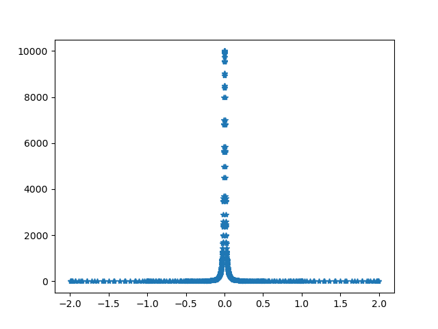
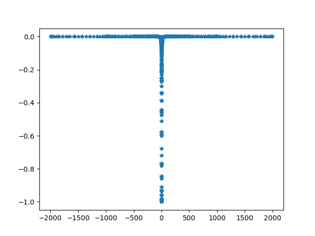

<!-- toc -->

<!-- more -->
$F(\rho, z)$ 是一个光滑，并且在正负无穷快速decay到时0,的函数，比如 $F(\rho, z) = 1/(z^2 + 1)$。我们想要计算
$$
\lim_{\rho\to 0} \frac{\partial}{\partial\rho}\left[\rho
\int_{-\infty}^{+\infty} \frac{F(\rho, z)}{\rho^2 + z^2}\mathrm{d}z\right]
$$

其中的积分
$$
\int_{-\infty}^{+\infty} \frac{F(\rho, z)}{\rho^2 + z^2}\mathrm{d}z
$$
可以在 $\rho\to 0$ 处展开
$$
\int_{-\infty}^{+\infty} \frac{F(\rho, z)}{\rho^2 + z^2}\mathrm{d}z
= \frac{\pi}{\rho}F(0, 0) + C_0 + C_1 \rho + C_2\rho^2 + \cdots
$$
其中第一项
$$
\lim_{\rho\to 0}\int_{-\infty}^{+\infty} \frac{F(\rho, z)}{\rho^2 + z^2}\mathrm{d}z
=\lim_{\rho\to 0}\int_{-\infty}^{+\infty} \frac{F(\rho, z)}{\rho}\frac{\rho}{\rho^2 + z^2}\mathrm{d}z
=\int_{-\infty}^{+\infty} \frac{F(\rho, z)}{\rho}\pi\delta(z)\mathrm{d}z
= \frac{\pi}{\rho}F(0, 0)
$$
代回原式后得
$$
\lim_{\rho\to 0} \frac{\partial}{\partial\rho}\left[\rho
\int_{-\infty}^{+\infty} \frac{F(\rho, z)}{\rho^2 + z^2}\mathrm{d}z\right]
 = C_0
$$
也就是说，我们想要的就是 $C_0$。但这在数值上如何计算呢？我们可以把发散的部分
$$
\lim_{\rho\to 0}\int_{-\infty}^{+\infty} \frac{F(\rho, z)}{\rho^2 + z^2}\mathrm{d}z
=
\int_{-\infty}^{+\infty} \frac{F(0, z)}{ z^2}\mathrm{d}z
= \frac{\pi}{\rho}F(0, 0)
$$
减去，就得到
$$
\lim_{\rho\to 0} \frac{\partial}{\partial\rho}\left[\rho
\int_{-\infty}^{+\infty} \frac{F(\rho, z)}{\rho^2 + z^2}\mathrm{d}z\right]
=
\int_{-\infty}^{\infty}\left[
\frac{F(0, z)}{z^2} - \frac{F(0, 0)}{z^2}\right]\mathrm{d}z
$$
这样我们就可以做数值计算了。
# 例
比如$F(\rho, z) = 1/(z^2 + 1)$时，
$$
\int_{-\infty}^{\infty}\left[
\frac{1}{z^2}\frac{1}{z^2 + 1} - \frac{1}{z^2}\frac{1}{0^2 + 1}\right]\mathrm{d}z
= \int_{-\infty}^{\infty}
\frac{-1}{z^2 + 1} \mathrm{d}z = -\pi
$$

```python
import matplotlib.pyplot as plt
import numpy as np
from scipy.integrate import quad


def quad_recorded(func, *args, **kwargs):
    """
    use scipy.integrate.quad, but return the results with additional
    information "nc" and "vc".

    Returns:
        inte_res: the return of scipy.integrate.quad
              nc: the points calculated
              vc: the calculated functiona values
    """
    def func_recorded(x, node_container, value_container):
        res = func(x)
        node_container.append(x)
        value_container.append(res)
        return res
    nc = []
    vc = []
    inte_res = quad(lambda x: func_recorded(x, node_container=nc,
                                            value_container=vc),
                    *args, **kwargs)
    idx = np.argsort(np.array(nc))
    nc = np.array(nc)[idx].tolist()
    vc = np.array(vc)[idx].tolist()
    return inte_res, nc, vc


def f(r, z):
    return 1/(1 + z**2)

def foo(r, z):
    return f(r, z)/(r**2 + z**2)


# check the first term in expansion
r = 0.01
res, nc, vc = quad_recorded(lambda z: foo(r, z), -2, 2, points=[0])
plt.plot(nc, vc, '*')
print('numeric:', res)
print('analytic:', np.pi/r*f(0, 0))
plt.savefig('first-term.png', transparent=True)
plt.clf()


# calculate the Hadamard finite part
def fini(z):
    return f(0, z)/z**2 - f(0, 0)/z**2

res, nc, vc = quad_recorded(fini, -2000, 2000, points=[0])
plt.plot(nc, vc, '*')
# print('numeric:', res)
# print('analytic:', np.pi/r*f(0, 0))
print(res)
plt.savefig('finite-part.png', transparent=True)
```


```python
numeric: (310.9760738639882, 9.137428740868536e-07)
analytic: 314.1592653589793
(-3.140592653672964, 4.381553441406457e-11)
```




[Hadamard.py](2023-10-23-physics-Hadamard/Hadamard.py)

# 致谢

1. F Yang and R Qi

