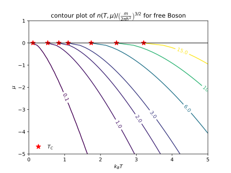
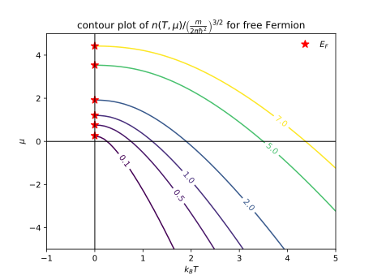

<!-- toc -->

<!-- more -->

- [Bose-Einstein distribution](#bose-einstein-distribution)
    - [Free Boson](#free-boson)
    - [Condensation of free Boson](#condensation-of-free-boson)
    - [Condensation of Fermi pairs](#condensation-of-fermi-pairs)
    - [More generally dispersion cases](#more-generally-dispersion-cases)
- [Fermi-Dirac distribution](#fermi-dirac-distribution)
- [Maxwell-Boltzmann distribution](#maxwell-boltzmann-distribution)
- [Reference](#reference)

# Bose-Einstein distribution

## Free Boson
For free Bosons, the particle density can be written as the sum of the Bose-Einstein distribution for every energy level with momentum $\mathbf{k}$,
$$
n(T, \mu) = \frac{1}{V}\sum_{\mathbf{k}}
\frac{1}{e^{ \frac{1}{k_B T}\left( \frac{\hbar^2 k^2}{2m} - \mu\right)} - 1}
= \frac{1}{V}\sum_{\mathbf{k}}
\frac{1}{z^{-1}e^{ \frac{1}{k_B T} \frac{\hbar^2 k^2}{2m}} - 1}
$$
where fugacity $z = e^{\frac{\mu}{k_BT}}$. Using
$$
 \frac{1}{V} \sum_{\mathbf{k}}\to \frac{1}{(2\pi)^3}\int \mathrm{d}^3k
$$
convert a sum over momentum states into an integral, then,
$$
\begin{align}
n(T, \mu) =& \frac{4\pi}{(2\pi)^3}\int_0^{\infty} \mathrm{d}k
\frac{k^2}{z^{-1}e^{ \frac{1}{k_B T} \frac{\hbar^2 k^2}{2m} } - 1}\\
=& \frac{1}{\lambda_{\mathrm{d.B.}}^3} \frac{4}{\sqrt{\pi}}
  \int_0^{\infty}\mathrm{d}x \frac{x^2}{z^{-1}e^{x^2} - 1}\\
=& \frac{1}{\lambda_{\mathrm{d.B.}}^3} \frac{2}{\sqrt{\pi}}
  \int_0^{\infty}\mathrm{d}\varepsilon \frac{\sqrt{\varepsilon}}{z^{-1}e^{\varepsilon} - 1} \\
=& \frac{1}{\lambda_{\mathrm{d.B.}}^3} \mathrm{Li}_{3/2}(z) \\
=& \left(\frac{m k_B T}{2 \pi \hbar^2} \right)^{3/2}\mathrm{Li}_{3/2}(z)
\end{align}
$$
where we have defined the thermal de Broglie wavelength
 $\lambda_{\mathrm{d.B.}} = \sqrt{\frac{2\pi \hbar^2}{m k_B T}}$ by setting

$$
\frac{\hbar^2}{m}\frac{1}{\lambda_{\mathrm{d.B.}}^2} = \frac{k_B T}{2\pi}.
$$

The [Polylogarithm](https://en.wikipedia.org/wiki/Polylogarithm) is defined as

$$
\begin{align}
\mathrm{Li}_s(z) = \sum_{k = 1}^{\infty} \frac{z^k}{k^s}
\end{align}
$$

[free-bose.py](./2023-11-03-physics-phase_diagram_of_statistic_function/free-bose.py)

## Condensation of free Boson

For free Bosons, when the density fixed, lower the temperature, the chemical potential will approach $0$. Therefore the Bosons will condense to the zero momentum states. Therefore, we can find the condensate critical temperature $T_C$ by setting $\mu\to 0$,
$$
k_B T_C = \left(\frac{n}{\mathrm{Li}_{3/2}(1)}\right)^{2/3}\frac{1}{\frac{m}{2\pi\hbar^2}}
$$
where $\mathrm{Li}_{3/2}(1) = \zeta(3/2)\approx2.612$.

## Condensation of Fermi pairs

The two components Fermion system on the strong BEC side, every two Fermions form a bound Boson pairs. Thus we can consider this system as a free Bosons. We label the density of pairs as $n$, also every component has a density $n$. Label the mass of a Fermion as $m$, so the mass of a pair is $M=2m$, and the chemical potential $2\mu$. We define the Fermi momentum as $k_F^3 = 6\pi^2 n$, and Fermi energy as $E_F = \frac{\hbar^2 k_F^2}{2m}$. Then the density of pairs can be written as
$$
\begin{align}
n(T, 2\mu)
= \left(\frac{M k_B T}{2 \pi \hbar^2} \right)^{3/2}\mathrm{Li}_{3/2}(z)
\end{align}
$$
where $z=e^{\frac{2\mu}{k_B T}}$. We can get the condensate critical temperature of pairs

$$
k_B T_C = \left(\frac{n}{\mathrm{Li}_{3/2}(1)}\right)^{2/3}\frac{1}{\frac{M}{2\pi\hbar^2}} = \frac{2\pi}{\left[6\pi^2\mathrm{Li}_{3/2}(1)\right]^{2/3}} E_F
\approx 0.218 E_F
$$

## More generally dispersion cases

$$
\int_0^{\infty}\mathrm{d}\varepsilon \frac{x^{\nu}}{z^{-1} e^{\varepsilon} - 1}
= \Gamma(1+\nu)\mathrm{Li}_{1+\nu}(z)
$$
where $\nu = 1/2$ for the 3D free Boson. And the gamma function

$$
 \Gamma(z)=\int _0^{\infty}\mathrm{d}t\cdot e^{-t} t^{z-1}
$$
which $\Gamma(3/2) = \sqrt{\pi}/2$ for the 3D free Boson.

For Fermion case

$$
\int_0^{\infty}\mathrm{d}\varepsilon \frac{x^{\nu}}{z^{-1} e^{\varepsilon} + 1}
= -\Gamma(1+\nu)\mathrm{Li}_{1+\nu}(-z)
$$

# Fermi-Dirac distribution

For free Bosons, the particle density can be written as the sum of the Bose-Einstein distribution for every energy level with momentum $\mathbf{k}$,
$$
n(T, \mu) = \frac{1}{V}\sum_{\mathbf{k}}

\frac{1}{z^{-1}e^{ \frac{1}{k_B T} \frac{\hbar^2 k^2}{2m}} + 1}
$$
where fugacity $z = e^{\frac{\mu}{k_BT}}$. Convert a sum over momentum states into an integral, then,
$$
\begin{align}
n(T, \mu) =& \frac{4\pi}{(2\pi)^3}\int_0^{\infty} \mathrm{d}k
\frac{k^2}{z^{-1}e^{ \frac{1}{k_B T} \frac{\hbar^2 k^2}{2m} } + 1}\\
=& \frac{1}{\lambda_{\mathrm{d.B.}}^3} \frac{4}{\sqrt{\pi}}
  \int_0^{\infty}\mathrm{d}x \frac{x^2}{z^{-1}e^{x^2} + 1}\\
=& \frac{1}{\lambda_{\mathrm{d.B.}}^3} \frac{2}{\sqrt{\pi}}
  \int_0^{\infty}\mathrm{d}\varepsilon \frac{\sqrt{\varepsilon}}{z^{-1}e^{\varepsilon} + 1} \\
=& \frac{1}{\lambda_{\mathrm{d.B.}}^3} \left[-\mathrm{Li}_{3/2}(-z)\right] \\
=& \left(\frac{m k_B T}{2 \pi \hbar^2} \right)^{3/2}\left[-\mathrm{Li}_{3/2}(-z)\right]
\end{align}
$$

[free-fermi.py](./2023-11-03-physics-phase_diagram_of_statistic_function/free-fermi.py)

# Maxwell-Boltzmann distribution

# Reference

- [Polylogarithm](https://en.wikipedia.org/wiki/Polylogarithm)
- [Gamma function](https://en.wikipedia.org/wiki/Gamma_function)
- Pathria, R. K., and Paul D. Beale. Statistical Mechanics. 3rd ed. Amsterdam ; Boston: Elsevier/Academic Press, 2011. Chap.7 and Appendices D, E.
- Stoof, Henk T. C., Koos B. Gubbels, and Dennis B. M. Dickerscheid. Ultracold Quantum Fields. Theoretical and Mathematical Physics. Dordrecht ; New York: Springer, 2009. Chap.4.3.
