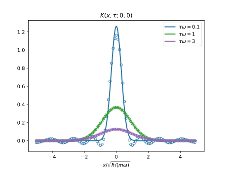

<!-- toc -->

<!-- more -->

# 利用虚时传播子求解定态散射问题

本文考虑一维问题

## 传播子(propagator)

如果 $\hat{H}$ 不含时，虚时传播子为
$$
\begin{align}
  K(x, \tau; x', 0) = \langle x | e^{-\hat{H}\tau} | x'\rangle
  = \sum_n e^{-E_n\tau}\langle x| n\rangle \langle n| x'\rangle
\end{align}
$$
其中 $|n\rangle$ 是 $\hat{H}$ 的本征态
$$
\begin{align}
  \hat H | n\rangle = E_n | n\rangle
\end{align}
$$

## 散射问题

$$
\begin{align}
  (\hat{H} + \hat{V} )|\phi\rangle = E|\phi\rangle
\end{align}
$$
移项并投影到 $\hat{H}$ 的本征态 $|n\rangle$ 上
$$
\begin{align}
  \langle n|(\hat{H} - E )|\phi\rangle = -\langle n|\hat{V}|\phi\rangle
\end{align}
$$
$$
\begin{align}
  \langle n|\phi\rangle =& -\frac{1}{E_n - E }\langle n|\hat{V}|\phi\rangle \\
  =& -\frac{1}{E_n - E }\langle n|\hat{V}|\phi\rangle \\
  =&-\int_0^{\infty} \mathrm{d}\tau \, e^{-(E_n - E)\tau}\langle n|V|\phi\rangle \\
  =&-\int_0^{\infty} \mathrm{d}\tau \, e^{E\tau}\cdot e^{-E_n \tau}\langle n|V|\phi\rangle
\end{align}
$$
最后一步 Schwinger parametrization 需要散射能量 $E$ 小于 $E_n$.

散射波函数可以写成
$$
\begin{align}
  \phi(x) = \langle x|\phi\rangle
  = \sum_n \langle x | n \rangle \langle n|\phi\rangle
\end{align}
$$
代入我们之前算得的 $\langle n |\phi\rangle$
$$
\begin{align}
  \phi(x) =& -\int_0^{\infty} \mathrm{d}\tau \, e^{E\tau}\cdot
  \sum_n e^{-E_n \tau}  \langle x | n \rangle \langle n|V|\phi\rangle \\
  =& -\int_0^{\infty} \mathrm{d}\tau \, e^{E\tau}\cdot
  \int \mathrm{d} x'\,
  \sum_n e^{-E_n \tau}  \langle x | n \rangle \langle n|x'\rangle\langle x'|V|\phi\rangle
\end{align}
$$
会发现其中出现了传播子.就得到
$$
\begin{align}
  \phi(x) =& -\int_0^{\infty} \mathrm{d}\tau \, e^{E\tau}\cdot
  \sum_n e^{-E_n \tau}  \langle x | n \rangle \langle n|V|\phi\rangle \\
  =& -\int_0^{\infty} \mathrm{d}\tau \, e^{E\tau}\cdot
  \int \mathrm{d} x'\,
   \langle x'|V|\phi\rangle K(x, \tau; x', 0)
\end{align}
$$

## 例: 一维简谐势中接触吸引的两粒子

通过质心相对坐标分离后，相对运动部分的哈密顿量为
$$
\begin{align}
  \hat{H} +\hat{V} = \frac{\hat{p}^2}{2\mu} + \frac{\mu}{2}\omega^2 \hat{x}^2 + \hat{V}
\end{align}
$$
其中 $\hat{V}$ 是接触相吸引互作用，
$$
\begin{align}
  \hat{V} |x\rangle = -g\delta(x) |x\rangle
\end{align}
$$
那么散射波函数为
$$
\begin{align}
  \phi(x)
  =& -\int_0^{\infty} \mathrm{d}\tau \, e^{E\tau}\cdot
  \int \mathrm{d} x'\,
   \langle x'|V|\phi\rangle K(x, \tau; x', 0) \\
   =& g \phi(0)\int_0^{\infty} \mathrm{d}\tau \, e^{E\tau}\cdot
  K(x, \tau; x', 0)
\end{align}
$$
其中的传播子即为一维谐振子的传播子: [Mehler kernel](https://en.wikipedia.org/wiki/Mehler_kernel)。

## 数值验证传播子

```python
import numpy as np
import matplotlib.pyplot as plt
import scipy.integrate as integrate
from scipy.special import hermite
import math


# x = np.linspace(-3, 3)
# check hermite polynomials
# plt.plot(x, hermite(3)(x))
# plt.plot(x, 8*x**3 - 12*x, 'x')


def ho_eig(x, n, m=1, o=1):
    """harmonic oscillator eigenfunctions and eigenvalues"""
    psi = 1 / np.sqrt(2**n * math.factorial(n))
    psi *= (m*o / np.pi)**(1/4)
    psi *= np.exp(-m*o * x**2 / 2)
    psi *= hermite(n)(np.sqrt(m*o) * x)
    energy = (n + 1/2) * o
    return energy, psi


# check ho_eig
# x = np.linspace(-10, 10, 1000)
# plt.plot(x, ho_eig(x, 3)[1])
# integrate.quad(lambda x:(ho_eig(x, 3)[1])**2,-10, 10)


def Mehler_kernel(x, tau, x0=0, m=1, o=1):
    """propagator of 1D harmonic oscillator, also known as Mehler kernel"""
    K = np.sqrt(m*o/2/np.pi/np.sinh(o*tau))
    K *= np.exp(-(m*o*(x**2 + x0**2)*np.cosh(o*tau) - 2*x*x0)/2/np.sinh(o*tau))
    return K


# check Mehler_kernel
# x = np.linspace(-10, 10, 1000)
# for ti in [0.1, 1, 2]:
#     plt.plot(x, Mehler_kernel(x, tau=ti))
#     print(integrate.quad(lambda x:Mehler_kernel(x, tau=0.1), -5, 5))


def HO_propagator(x, tau, x0=0, m=1, o=1, cut=15):
    """1D harmonic oscillator propagator, by eigenfunction expansion"""
    p = 0
    for n in range(cut):
        energy, psi = ho_eig(x, n)
        _, psi0 = ho_eig(x0, n)
        p += np.exp(-energy*tau) * psi * psi0
    return p


# compare the results of 1D harmonic oscillator propagator given by two methods
x = np.linspace(-5, 5, 1000)
for ti in [0.1, 1, 3]:
    p = plt.plot(x, Mehler_kernel(x, tau=ti), lw=2,
                 label=rf'$\tau\omega={ti}$')
    plt.plot(x[::10], HO_propagator(x, tau=ti)[::10], lw=0,
             marker='o', mec=p[0].get_color(), ms=5, mfc='none')
    print(integrate.quad(lambda x:Mehler_kernel(x, tau=0.1), -5, 5))
plt.title(r'$K(x, \tau; 0, 0)$')
plt.xlabel(r'$x/\sqrt{\hbar/(m\omega)}$')
plt.legend()
plt.savefig('HO_propagator.svg', transparent=True)

```



## Reference

- Shina Tan 的 lecture note.
- [Wikipedia: Propagator](https://en.wikipedia.org/wiki/Propagator)
- [Wikipedia: Mehler kernel](https://en.wikipedia.org/wiki/Mehler_kernel)
- [Wikipedia: Schwinger parametrization](https://en.m.wikipedia.org/wiki/Schwinger_parametrization)
- [Physics Stackexchange: Differentiating Propagator, Green's function, Correlation function, etc](https://physics.stackexchange.com/questions/20797/differentiating-propagator-greens-function-correlation-function-etc/476630#476630)
- [Physics Stackexchange: Dirac Delta in definition of Green function](https://physics.stackexchange.com/questions/209846/dirac-delta-in-definition-of-green-function)
