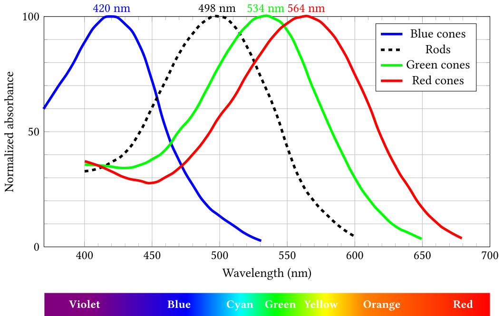

人为什么会感觉到不同的颜色？颜色为什么可以用三基色混合而成？让我们从光的质出发来理解这些问题。

目录：

- [人眼对光的感知](#人眼对光的感知)
- [色彩空间](#色彩空间)
  - [LMS 色彩空间](#lms-色彩空间)
  - [CIE RGB 色彩空间](#cie-rgb-色彩空间)
  - [CIE XYZ 色彩空间](#cie-xyz-色彩空间)
  - [CIE xyY 色彩空间](#cie-xyy-色彩空间)
  - [其它 RGB 色彩空间](#其它-rgb-色彩空间)
  - [其它色彩空间](#其它色彩空间)
- [HSL 和 HSV 色彩空间](#hsl-和-hsv-色彩空间)
- [色彩搭配网站](#色彩搭配网站)

-------------------------------------------------------------------------------

## 人眼对光的感知

人眼中有[视锥细胞](https://zh.wikipedia.org/zh-cn/%E8%A7%86%E9%94%A5%E7%BB%86%E8%83%9E)（[cone cell](https://en.wikipedia.org/wiki/Cone_cell)）和[视杆细胞（rod cell）](https://zh.wikipedia.org/zh-cn/%E8%A7%86%E6%9D%86%E7%BB%86%E8%83%9E)两种[感光细胞（photoreceptor cell）](https://zh.wikipedia.org/zh-cn/%E6%84%9F%E5%85%89%E7%BB%86%E8%83%9E)。不同的感光细胞含有不同的[视蛋白（opsins）](https://en.wikipedia.org/wiki/Opsin)，因此不同的感光细胞对不同波长的光敏感程度不同。

视杆细胞只对光比较敏感，但只有一种光敏色素。相比于视杆细胞对光，视锥细胞对光的敏感度比较低，但有三种类型，分别可以感受长波长（Long, L），中波长（Medium, M）和短波长（Short, S）的光（[trichromacy](https://en.wikipedia.org/wiki/Trichromacy)）。[^1]

<table>
  <th colspan=4>
  四种感光细胞对不同波长的光的敏感程度
  </th>
  <tr>
    <td>Blue cones</td>
    <td>Rods</td>
    <td>Green cones</td>
    <td>Red cones</td>
  </tr>
    <tr>
    <td>420 nm #6a00ff</td>
    <td>498 nm #00ffa9</td>
    <td>534 nm #6cff00</td>
    <td>564 nm #cfff00</td>
  </tr>
  <tr>
    <td bgcolor="#6a00ff" height="20"></td>
    <td bgcolor="#00ffa9" height="20"></td>
    <td bgcolor="#6cff00" height="20"></td>
    <td bgcolor="#cfff00" height="20"></td>
  </tr>
  <tr>
  <td colspan=4>
  波长到RGB在线转换：<a href="https://www.johndcook.com/wavelength_to_RGB.html">https://www.johndcook.com/wavelength_to_RGB.html</a>
  </td>
  </tr>
  <tr>
  <td colspan=4>
  <figure>
    
    <figcaption>
    图片来自 <a href="https://zh.wikipedia.org/zh-cn/File:1416_Color_Sensitivity.svg">Wikipedia</a>。
    视杆细胞、视锥细胞能看到的各波长。纵轴是各自归一化过的<a href="https://zh.wikipedia.org/zh-cn/%E5%90%B8%E5%85%89%E5%BA%A6">吸光度</a>。
    </figcaption>
  </figure>
  </td>
  </tr>
  <tr>
  <td colspan=4>
  <figure>
    
    <figcaption>
    图片来自 <a href="https://upload.wikimedia.org/wikipedia/commons/0/04/Cone-fundamentals-with-srgb-spectrum.svg">Wikipedia</a>。
    </figcaption>
  </figure>
  </td>
  </tr>
</table>

## 色彩空间

如何对不同的颜色定量地描述呢？最直接的描述就是人眼接收到光的光谱 $S(\lambda)$，其中 $\lambda$ 是光的波长。给定光谱 $S(\lambda)$，颜色也就确定了。本节提到的数学概念仅用于理解，不做严格定义。

但人眼感受到的同一种的颜色的光，光谱也可能不完全一样（[条件等色， Metamerism](https://en.wikipedia.org/wiki/Metamerism_(color))）。比如[太阳光](https://en.wikipedia.org/wiki/Sunlight)的光谱非常丰富，人眼感受到的颜色是白色。但电子显示器上白色，却只有红绿蓝三种光。原因很简单，光谱 $S(\lambda)$ 的变量是连续变化的波长 $\lambda$ 是一个无穷维的空间，但是人眼只有三种对波长敏感的细胞，把光谱 $S(\lambda)$ 投影到了三维空间上。所有具有相同颜色的光谱 $S(\lambda)$ 可以理解成一个等价类，人眼就只有分辨不同的等价类，不能分辨不同的光谱 $S(\lambda)$ 。简而言之，$S(\lambda)\mapsto \mathrm{Color}$ 不是单射。

直接用光的波长描述颜色也不好，因为有些颜色没有单一波长的光的对应。比如品红（#FF00FF，[magenta](https://en.wikipedia.org/wiki/Magenta)），就没有单一波长的可见光与之对应。原因是，波长 $\lambda$ 是单一变量，一维空间，但人眼能感受的颜色是三种视锥细胞的响应，是一个三维空间。简而言之，$\lambda\mapsto \mathrm{Color}$ 是单射，但不是满射。

我们想要一个好的描述，它应该是把无穷维的光谱，映射到一个三维的空间（因为有三种视锥细胞）。这个三维空间到所有的颜色的映射，即是单射，又是满射，即双射。或者近似是单射也行。这个有限维的空间，就是[色彩空间（color space）](https://en.wikipedia.org/wiki/Color_space)。[Grassmann 定律](https://en.wikipedia.org/wiki/Grassmann%27s_laws_(color_science))[^2]给出了一些色彩空间的性质，大致是说，色彩空间应该是一个“三维”，且“线性”的空间。

在 1931 年，国际照明委员会（[International Commission on Illumination, CIE](https://en.wikipedia.org/wiki/International_Commission_on_Illumination)）定义了人眼看到的一束光（光谱 $S(\lambda)$）的颜色，即，与色彩空间中的一个点的映射关系（[CIE 1931 color space](https://en.wikipedia.org/wiki/CIE_1931_color_space)）。

色彩空间有好多种。下面简要介绍。

### LMS 色彩空间

[LMS 色彩空间](https://en.wikipedia.org/wiki/LMS_color_space)就是直接根据人眼的三种视锥细胞的响应函数定义的。它是一个三维的线性空间，有三个坐标 $L, M$ ，和 $S$。由光谱 $S(\lambda)$ 到LMS 色彩空间的映射定义为

$$
\begin{align*}
L =& \int_{0}^{\infty}  S(\lambda) l(\lambda) \,\mathrm{d}\lambda, \\
M =& \int_{0}^{\infty}  S(\lambda) m(\lambda) \,\mathrm{d}\lambda, \\
S =& \int_{0}^{\infty}  S(\lambda) s(\lambda) \,\mathrm{d}\lambda,
\end{align*}
$$

其中响应函数 $l(\lambda), m(\lambda)$ 和 $ s(\lambda)$ 由实验测定。即使是不同的光谱 $S(\lambda)$ ，只要坐标 $L, M, S$ 相同，人眼感受的颜色就是相同的。响应函数 $l(\lambda), m(\lambda)$ 和 $ s(\lambda)$ 也已经把人眼看不见的颜色做了截断。所以，从 LMS 色彩空间到所有人眼能感觉到的颜色的映射 $\mathcal{C}_{LMS}\mapsto \{\mathrm{Colors}\}$ 这是一个双射。

### CIE RGB 色彩空间

在 1931 年，国际照明委员会（[International Commission on Illumination, CIE)](https://en.wikipedia.org/wiki/International_Commission_on_Illumination)）实验测定的色彩空间。

实验用波长为 435.8nm（蓝）， 546.1nm（绿）， 700nm（红） 三种光混合，调节比例，使被试者认为混合之后的颜色，与某个波长的单色光（从连续光谱的光源通过分光获得）颜色相同，记下比例。由此可以测出响应函数 $\bar{r}(\lambda), \bar{g}(\lambda)$ ，和 $\bar{b}(\lambda)$ ,

$$
\begin{align*}
R =& \int_{0}^{\infty}  S(\lambda) \bar{r}(\lambda) \,\mathrm{d}\lambda, \\
G =& \int_{0}^{\infty}  S(\lambda) \bar{g}(\lambda) \,\mathrm{d}\lambda, \\
B =& \int_{0}^{\infty}  S(\lambda) \bar{b}(\lambda) \,\mathrm{d}\lambda.
\end{align*}
$$

||
| :---: |
| 实验测得的 Color Matching Function。纵轴是归一化过的。给定一个横轴的值，三条曲线在此处的值，对应的就是合成此波长的单色光所需的三种颜色的光的比例。图片来自 [Wikipedia](https://upload.wikimedia.org/wikipedia/commons/0/0c/CIE1931_RGBCMF2.png)。 |

仔细观察可以发现，在 435.8nm（蓝）， 546.1nm（绿）， 700nm（红）三处，只有一种光有值，其它光为零就可以合成。比如 700nm（红）的单色光的颜色的坐标为，

$$
\begin{align*}
R_{\mathrm{R}} = & \int_{0}^{\infty}  \delta(\lambda - \lambda_{\mathrm{R}}) \bar{r}(\lambda) \,\mathrm{d}\lambda, \\
G_{\mathrm{R}} = & \int_{0}^{\infty}  \delta(\lambda - \lambda_{\mathrm{R}}) \bar{g}(\lambda) \,\mathrm{d}\lambda = 0, \\
B_{\mathrm{R}} = & \int_{0}^{\infty}  \delta(\lambda - \lambda_{\mathrm{R}}) \bar{b}(\lambda) \,\mathrm{d}\lambda = 0.
\end{align*}
$$

除了这三个点外，都由两个正值，一个负值合成。负值代表的意义是减去该颜色的光，实验上是用该颜色的光照到单色光源上，以此来等效实现。

### CIE XYZ 色彩空间

CIE RGB 色彩空间会出现负值，这会很不方便。由此就从 CIE RGB 定义了一个新的色彩空间。三个坐标为 $X, Y$ ， 和 $Z$。其中 $Y$ 选做 [亮度（luminance）](https://en.wikipedia.org/wiki/Luminance)的响应函数。$Z$ 先择与 LMS 色彩空间的的 $S$ 相同。选适当的 $X$ 使得坐标在可见单色光谱内的所有颜色的坐标非负。

||
| :---: |
| CIE XYZ 色彩空间的 Color Matching Function。图片来自 [Wikipedia](https://en.wikipedia.org/wiki/File:CIE_1931_XYZ_Color_Matching_Functions.svg)。 |

CIE XYZ 色彩空间和 LMS 色彩空间之间的线性变换为，

$$
\begin{align*}
  \begin{pmatrix}
    X\\
    Y\\
    Z
  \end{pmatrix} =
    \begin{pmatrix}
  1.91020 & -1.11212 & 0.20191\\
  0.37095 & 0.62905  & 0\\
  0       & 0        & 1
  \end{pmatrix}
  \begin{pmatrix}
  L\\
  M\\
  S
  \end{pmatrix}_{\mathrm{HPE}}
\end{align*}
$$

### CIE xyY 色彩空间

由于 CIE XYZ 的 Y 选做亮度，所以定义

$$
\begin{align*}
x =& \frac{X}{X + Y + Z}\\
y =& \frac{Y}{X + Y + Z}
\end{align*}
$$
这样 $x, y$ 取值在 $0$ 和 $1$ 之间。在给定亮度下，在 $x-y$ 平面内就表示了所有的颜色。

||
| :---: |
| CIE xyY 色彩空间。图片来自 [Wikipedia](https://en.wikipedia.org/wiki/File:CIE1931xy_CIERGB.svg)。图中的光滑边缘是单色可见光谱。三角形由 CIE RGB 的三个从单色可见光谱中选取的围成。在三角形内, CIE RGB 坐标是非负的，而在外面，至少有一个值为负。同时也可以看出，在左上部分有较大部分在三角形外，对应的是 $R$ 坐标为负的那部分青光。同时值得注意，这里只是示意图，因为普通显示器不可能显示出这里的所有的颜色。 |

### 其它 RGB 色彩空间

除了 CIE RGB 色彩空间，还有许多其它的 RGB 色彩空间。比如，我们常用的用十六进制表示的 RGB 颜色（#RRGGBB）就是 [sRGB](https://en.wikipedia.org/wiki/SRGB) 色彩空间中的坐示。

||
| :---: |
| 其它 RGB 色彩空间在 CIE xy 坐标中的色域（[gamut](https://en.wikipedia.org/wiki/Gamut)）。图片来自 [Wikipedia](https://en.wikipedia.org/wiki/File:CIE1931xy_gamut_comparison.svg)。 |

### 其它色彩空间

[CIELAB 色彩空间](https://en.wikipedia.org/wiki/CIELAB_color_space)等。

## HSL 和 HSV 色彩空间

设计和画画的时候，还经常用到 [HSL 和 HSV 色彩空间](https://en.wikipedia.org/wiki/HSL_and_HSV)。他们是把 RGB 色彩空间做了简单的变换，使得人们可以更容易地调出想要的颜色。

## 色彩搭配网站

- [Material design tools for picking colors](https://m2.material.io/design/color/the-color-system.html?utm_source=chatgpt.com#tools-for-picking-colors)：谷歌为 Material Design 提供的色彩搭配工具，选一个主题色，会自动给出相应的搭配色彩。同时也介绍了一些色彩搭配的基本概念。
- [happyhues](https://www.happyhues.co/)：提供了一些色彩搭配方案。作者 [Mackenzie](https://www.mackenziechild.me/) 是一名前端工程师。
- [coolors.co](https://coolors.co/)：一个调色盘网站。
- [colorhunt.co](https://colorhunt.co)：提供了很多配色，每一套四种颜色。可以根据标签查找。
- [中国传统色](https://zhongguose.com)、[日本传统色](https://nipponcolors.com)。

[^1]: 有一个把光谱转换成 RGB 色的 Python 包：[ColorPy](http://markkness.net/colorpy/ColorPy.html)。

[^2]: 没错，就是[Grassmann 数](https://en.wikipedia.org/wiki/Grassmann_number)的那个 [Hermann Grassmann（1809-1877）](https://en.wikipedia.org/wiki/Hermann_Grassmann)。
