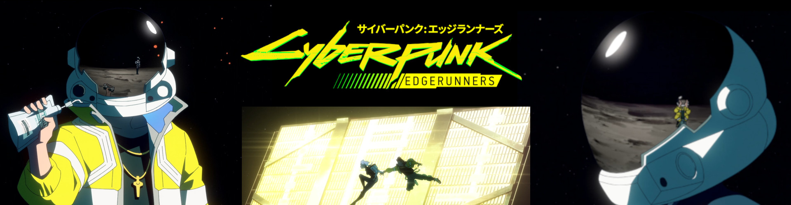
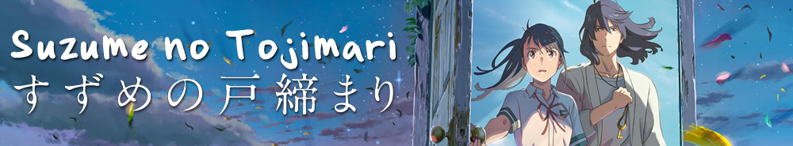

## Welcome to 从冰上的水

I am ZQW.

I am interested in physics, music, and coding.

Bingo! If your comes here from ORCiD or Google Scholar, and want to learn more about me.
(But there's no train from here to my ORCiD or Google Scholar page.)

Most of content in this site is written in Chinese. If you are interested, you can use translators, such as [Google translator](https://translate.google.com), [DeepL](https://www.deepl.com)...

Have a nice day!

------------------------------------------------------------------------------

## 欢迎来到“从冰上的水”

“从冰上的水”这个是我第一次玩[跑跑卡丁车](https://zh.wikipedia.org/wiki/%E8%B7%91%E8%B7%91%E5%8D%A1%E4%B8%81%E8%BD%A6)时在键盘上随机打出的 ID。现在把博客也叫这个名字，为之纪念。

职业是物理，兴趣爱好是物理、音乐和写程序。这里有一些生活随笔和科研笔记。

我把自己的 ORCiD 和 Google Scholar 链接到了这里。这里可以了解更多和科研关系不大的方面。但是这里没有给出到 ORCiD 和 Google Scholar 的链接。

欢迎发电子邮件和我交流: <zeqing6688@126.com>！关于本站点的搭建，可以参考标签[#blog](/tag/blog)下的博客。

## 系列文章：

- [#总结](/tag/zong-jie)：个人总结汇总。
- [#blog](/tag/blog)：本博客的搭建历史。
- [#初中回忆录](/tag/chu-zhong-hui-yi-lu)：初中毕业时写的。以前在新浪博客上，现在搬了过来。
- [#文学青年](/tag/wen-xue-qing-nian)：虚构故事。文学青年的梦一直在。
- [#Atomic and Optical Physics](/tag/atomic-and-optical-physics)：Wolfgang Ketterle 的 [AMO 公开课](https://www.youtube.com/playlist?list=PLUl4u3cNGP62FPGcyFJkzhqq9c5cHCK32)笔记。
- [#Susskind](/tag/susskind)：Susskind 的公开课笔记。
- [#Carl Bender](/tag/carl-bender)：Carl Bender 的 [Perturbation Theory 公开课](https://www.youtube.com/playlist?list=PLzcd6SoIscwjHuWRE38UXWG92uq0Sy4UF)笔记。
## Blogroll

这里列出一些优秀的个人站点。

| 站名 | 简介 |
| --- | --- |
| [Susskind's Blog: Physics for Everyone ](https://susskindsblogphysicsforeveryone.blogspot.com/) | Susskind 教授的系列公开课：[Theoretical Minimum](https://theoreticalminimum.com/courses)  是我读博期间科研受挫时的精神慰藉。 |
| [ Gerard ’t Hooft](https://webspace.science.uu.nl/~hooft101/) | 著名物理学家。他给出了物理学从入门到精通：[How to become a GOOD Theoretical Physicist](https://www.goodtheorist.science/)。 |
| [Carl M. Bender's Home Page](https://web.physics.wustl.edu/cmb/) | Carl 教授的主页。我从他的公开课 [Perturbation Theory](https://www.youtube.com/playlist?list=PLzcd6SoIscwjHuWRE38UXWG92uq0Sy4UF) 中收获很多。|
| [physixfan](https://www.physixfan.com/) |物理专业出身的博主。 |
| [Yihui Xie 谢益辉](https://yihui.org/) | 非常优雅的个人主页。我从这里学习到很多。也从这里知道了很多优秀的个人博客。 |
| [Wiwi 的貼文和筆記](https://wiwi.blog/) | 极客音乐家。无论是音乐知识，还是搭建个人网站的一些理念，都使我受益匪浅。同时也从他的 [部落卷/Blogroll](https://wiwi.blog/blogroll) 里知道了好多优秀的个人博客。 |
| [阮一峰的网络日志](https://www.ruanyifeng.com/blog/) |著名博主，引用作者的介绍：“这里记录每周值得分享的科技内容，周五发布。” |
| [Yu-Xuan's Blog](https://yxli8023.github.io/) |充满热情的物理学研究者。 |
| [Alex Hsu 徐小翔](https://alexhsu.com/) | 引用作者的自我介绍：“獨立開發者，想成為作家。紀錄持續學習和追求簡單的感悟。” |
| [谁把钱丢了](https://jmyblog.top/) |引用作者的自我介绍：“一个不想努力的老阿姨”。 |
| [Miao Yu 于淼](https://yufree.cn/) |生活在美国的科学家。 |
| [Tan Jay 唐 洁](https://tang-jay.github.io/) |一位在读博士生。 |
| [Anthony Fu](https://antfu.me) |非常漂亮的博客，作者是专业开发者。作者我自我介绍：“A fanatical open sourceror and design engineer.”。 |
| [Derek Sivers](https://sive.rs/) |作者的自我介绍：“I’ve been a musician, circus performer, entrepreneur, and speaker.”。 |

## 往期 Banner

网站以前的版本，会用一个 Banner 放在顶部。这里列出以往用过的 Banner。基本就是那一段时期看了，也特别喜欢的动漫。图片大部分是从 [Fanart](https://fanart.tv/) 上找的。

### 2023 年 10 月 30 日至 2026 年 1 月 3 日：Cyberpunk: Edgerunners

用的是：[Cyberpunk: Edgerunners](https://bgm.tv/subject/309311)。基本是延期那段时间看的，[住在校外](./2025-04-06-blog-baicaoyuan_huizhou.md)。这个 Banner 是我自己把好几张拼在一直形成的。

### 2023 年 5 月 7 日至 2023 年 10 月 30 日：剧场版 刀剑神域 进击篇 黯淡黄昏的谐谑曲

用的是：[剧场版 刀剑神域 进击篇 黯淡黄昏的谐谑曲](https://bgm.tv/subject/355004)。和小戴去电影院看的。好看。

### 2023 年 4 月 23 日至 2023 年 5 月 7 日：【我推的孩子】

用的是：[【我推的孩子】](https://bgm.tv/subject/386809)。也是小戴推荐的。好看。

### 2023 年 3 月 28 日至 2023 年 4 月 23 日：铃芽之旅

用的是[铃芽之旅](https://bgm.tv/subject/362577)。也是去电影院看的，记得有好几个人一起。

### 2022 年 4 月 27 日至 2023 年 3 月 28 日：玉子爱情故事

用的是：[玉子爱情故事](https://bgm.tv/subject/90880)。是[玉子市场](https://bgm.tv/subject/55113)的剧场版。

### 2022 年至 2023 年：夏日重现

用的是：[夏日重现](https://bgm.tv/subject/326895)。也是小戴推荐的。好看。取景地是和歌山。离得不远，之后可以去看看。

